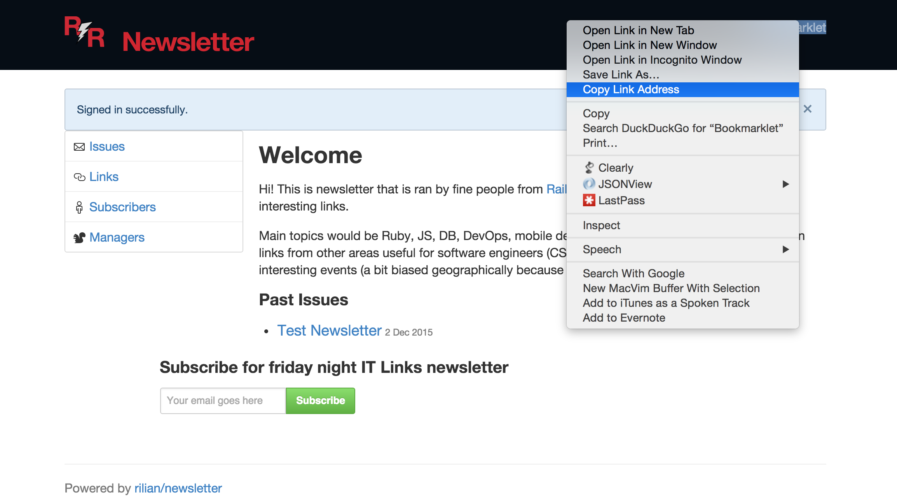
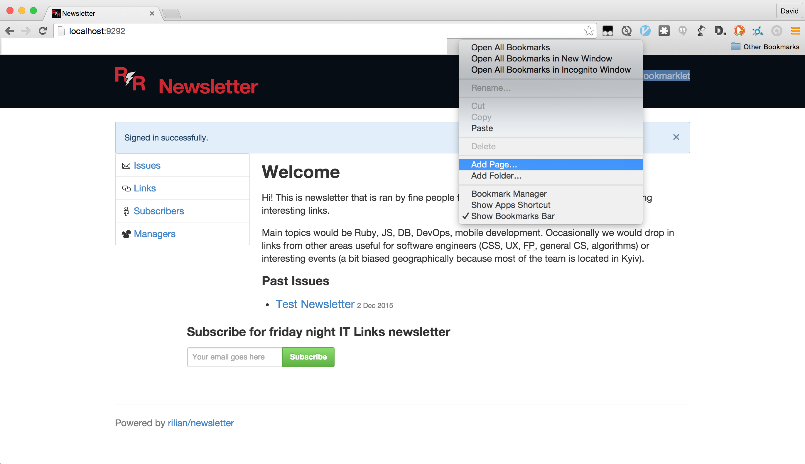
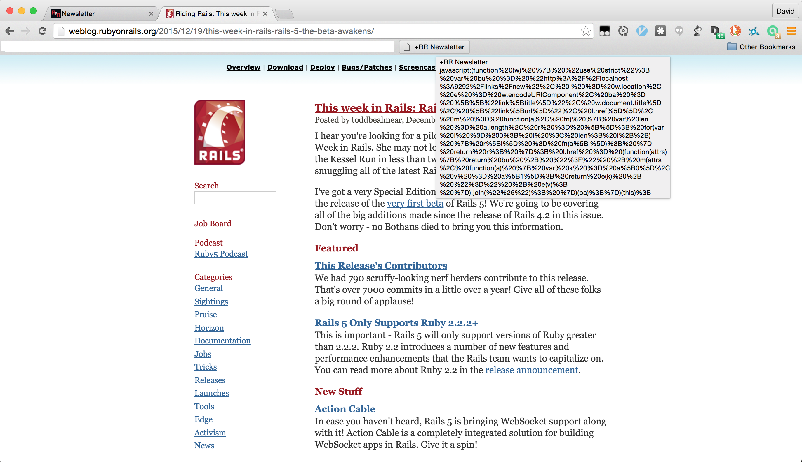
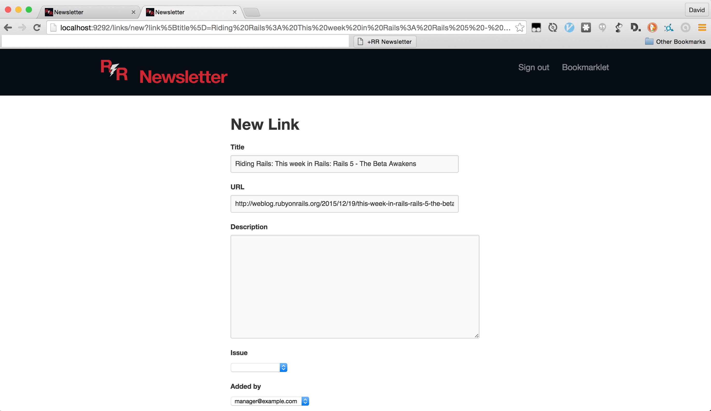

# Using the Bookmarklet

These instructions are for Chrome; most other browsers support a similar
method.

1) Right-click on the Bookmarklet link and select "Copy Link Address", or
whatever your browser's equivalent is.

2) Right-click on your Bookmarks Toolbar, and click "Add Page..."
(alternatively, you can add a new page from the Bookmarks menu).

3) Name the bookmark, paste your bookmarklet URL into the URL field, and click
"Save".

4) While visiting another site, click your bookmarklet.

5) You will be redirected to the newsletter's New Link page, and the title and
URL fields will be pre-populated with the title and URL of the page you were
just on. You can update the form as needed and save the link.

